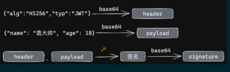

### guard
> 进行权限校验-JWT验证
> 进行授权

#### 关于JWT
> JWT(JSON Web Token)，JSON格式的Web Token，是一种用于身份认证的协议，可以替代Session。
> JWT（Json Web Token）的签发过程可以清晰地分为几个步骤，以下是详细的签发流程：

1. **用户登录**：
   - 用户向服务器发送登录请求，提供用户名和密码。

2. **服务器验证**：
   - 服务器接收到登录请求后，验证用户提供的用户名和密码是否正确。
   - 如果验证通过，服务器将进行下一步以生成JWT。

3. **JWT生成**：
   - JWT由三部分组成：Header（头部）、Payload（负载）和Signature（签名）。
   - **Header（头部）**：
     - 包含一个描述JWT元数据的JSON对象，通常包含算法（alg）和类型（typ）两个字段。
     - 例如：`{"alg": "HS256", "typ": "JWT"}`
     - 该JSON对象会被Base64Url编码形成JWT的第一部分。
   - **Payload（负载）**：
     - 包含声明（claims）的JSON对象，用于存放实际需要传递的数据。
     - 例如：`{用户名, 用户权限, 过期时间}`
     - 同样，这个JSON对象也会被Base64Url编码形成JWT的第二部分。
   - **Signature（签名）**：
     - 用于验证JWT是否被篡改以及确保JWT的发送者是谁。
     - 签名是通过将Header和Payload进行Base64Url编码后的字符串用“.”连接，然后使用服务器指定的密钥和签名算法进行加密。
     - 例如，如果使用的是HMAC SHA256算法和密钥secretKey，签名部分就是`HMACSHA256(base64UrlEncode(header) + "." + base64UrlEncode(payload), secretKey)`的结果再进行Base64Url编码。

4. **返回JWT**：
   - 服务器将Header、Payload和Signature三个部分用“.”连接成一个完整的字符串，形成最终的JWT。
   - 服务器将这个JWT返回给客户端。

5. **客户端存储JWT**：
   - 客户端在接收到JWT后，通常会将其保存在本地（如浏览器的localStorage或Cookie中）。

6. **客户端使用JWT**：
   - 在后续的请求中，客户端会在请求头中附带这个JWT，以便服务器验证用户的身份和权限。

通过这个过程，JWT实现了在客户端和服务器之间安全地传递用户信息的功能，同时避免了在服务器上保存大量会话数据的需求。

### 中间件
> 日志记录、日志记录、错误处理、数据转换、CORS设置